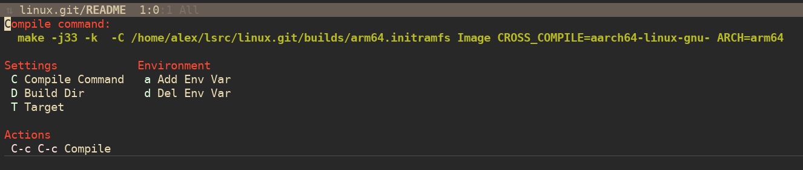

* *Homogeneous Unified Builder Interface*

Welcome to the *Homogeneous Unified Builder Interface* or *HUBI*

This is a "batteries included" extension for Emacs for building
software projects.

It presents transient interface when you can select the build tool,
build directory and target before invoking the build. It tries to
probe for build configuration so it can offer a narrowing list of
targets. The current build and history is stored in a per-project
.dir-locals-2.el file.

* History

A lot of the probe and configuration is inspired by `counsel-compile`
which I was also involved in developing. However the hope is the
transient interface presents a more natural interface for tweaking
things like build parameters than a pure narrowing interface.

* Installing

If there is interest I have no problem adding this to ELPA or MELPA.
However currently its origin as one persons pet quality of life tool
makes it suitable for those with an adventurous spirit who are happy
running the code out of a git tree.

HUBI depends on the `transient` package, which is built into modern
Emacs but may need updating from ELPA/MELPA for older versions.

Checkout the repository and then you can use something like
use-package to load it:

#+begin_src elisp :lexical no
  (use-package hubi
    :load-path "/path/to/hubi.git"
    :bind ("C-c c" . hubi))
#+end_src

* Supported Build Systems

HUBI currently supports the following build systems:

- **Make**: Standard Makefile discovery and target extraction.
- **Ninja**: Supports `build.ninja` and `Makefile.ninja`.
- **Meson**: Supports introspection of targets, tests, and benchmarks.
- **Cargo**: Supports Rust projects with workspace member discovery.

**Note on `jq` requirement**: For **Meson** and **Cargo** target discovery,
the `jq` utility is required to be installed on your system.

* Invocation

`M-x hubi` or your preferred global keybinding and you should be
presented with an interface like this:

Once you have selected the target and setup `C-c C-c` will invoke the
build tool. `C-g` will quit the interface.

** hubi-configure

Although you can `M-x hubi-configure` it is more usually triggered
from the main `hubi` interface. It follows a similar batteries
included approach and provides an e`x`tract configuration option to
populate the build configuration.

It currently understands the following configuration methods:

- **configure**: Various flavours of configure scripts
- **meson**: Sort of
- **cmake**: Even less well tested

* Contributing

This project is very much a scratch-your-personal itch style project
so it may be useful to nobody. Nevertheless the project is licensed
under GPLv3 and I'll happily accept well formed pull requests. There
is an AGENTS.md so the ability to use coding agents if you wish is
implied. However this doesn't absolve *you the human* of the
responsibility of understanding the purpose and structure of the
changes. Slop will be dropped unceremoniously.

